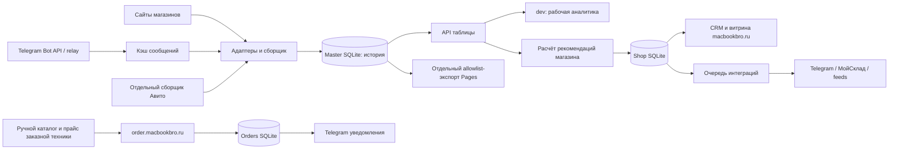

# Архитектурный и продуктовый аудит MacBookBro / Mac Price Radar

Дата: 29 сентября 2026 года. Объект: вся локальная система в `/Users/max/Documents/parser`, ветка `dev`, исходная база Git `5f1b585` и все существовавшие незакоммиченные изменения. Аудит подготовлен по запросу Максима. **Это оценка исходного кода и локальных проверок, а не подтверждение текущего состояния production.**

## Обновление после исправлений

Выпуск опубликован 29.09.2026. Фактические результаты и ограничения: [отчёт о выпуске](release-2026-09-29.md). **Уточнение F02 от Максима: время цены Димы — время отправки поста в нашего Telegram-бота; исходная дата поста сохраняется отдельно.**

Разделы 1–10 ниже фиксируют состояние **на момент первоначального аудита**. После него в рабочей копии внесены исправления по просьбе Максима. Они проверены и опубликованы. Внешние аккаунты интеграций не перенастраивались.

| Находка | Текущий статус | Что изменилось |
|---|---|---|
| F01 | Исправлено и опубликовано | Витрина использует те же нормализацию, группировку и пригодность цены, что и таблица; несовместимые варианты блокируют рекомендацию |
| F02 | Исправлено и опубликовано | Прайсы Димы сортируются по времени отправки в нашего бота; для SKU берётся последнее сообщение, время сбора не подменяет время цены |
| F03 | Исправлено для вариантов AFM «без цены» | Полный каталог создаёт событие отзыва прежней цены; история остаётся. Исчезновение карточки без явного статуса по-прежнему требует отдельной политики |
| F04 | Исправлено для новых записей | Явная не-RUB валюта сохраняется и попадает в карантин. Старые уже импортированные наблюдения автоматически не переконвертируются |
| F05 | Исправлено и опубликовано | Checkout фиксирует редакцию, характеристики, гарантию и сопоставление; изменение требует повторного подтверждения |
| F06 | Исправлено и опубликовано | Повтор с прежним ключом сверяет намерение клиента и возвращает сохранённую цену даже после изменения/истечения прайса |
| F07 | Исправлено и опубликовано | Новый Telegram-канал виден, но участвует в закупочной аналитике только после одобрения ID через серверный `TELEGRAM_APPROVED_SOURCE_IDS` |
| F08 | Частично | Добавлена согласованная копия базы заявок с проверкой целостности и checksum; внешнее расписание и учение восстановления всех трёх контуров ещё не настроены |
| F09 | Частично | CI теперь запускает тесты витрины наряду с остальными; автоматического проверенного развёртывания VPS ещё нет |
| F10 | Открыто | Production JavaScript по-прежнему вне проверки типов |
| F11 | Исправлено и опубликовано | Числовая цена заказа действует максимум 72 часа после проверки прайса; затем заявка принимается «по запросу» без старой суммы |
| F12 | Частично | Защищённый статус релея показывает очередь и её возраст; CRM показывает возраст нового заказа и проблемные обмены. Внешние уведомления по порогу ещё не настроены |
| F13 | Частично | Шаблон Caddy больше не подменяет Origin, parser разрешает два известных HTTPS-домена и проверяет настоящий Origin вместе с CSRF. На сервере убраны четыре подмены Origin; внешний чужой Origin отклонён с 403, CRM без входа возвращает 401 |
| F14 | Частично | Удалена дублирующая декларация таблицы; versioned migrations ещё не созданы |
| F15 | Открыто | Две операционные очереди заказов ещё не объединены |
| F16 | Частично | Legacy CLI больше не перезаписывает основной снимок; реорганизация кода и документов остаётся задачей сопровождения |

Пять сценариев в [audit/reproduce-2026-09-29.mjs](audit/reproduce-2026-09-29.mjs) теперь проверяют **исправленное** поведение. Регрессии также входят в обычные тесты. Перед публикацией сайта заказов нужно понимать, что прайс с `pricingInfo.checkedAt` от 25.09.2026 уже старше 72 часов: после развёртывания цены Mac будут показаны «по запросу», пока владелец не подтвердит новый прайс и не обновит дату. Не обновлять дату без проверки самих сумм и курса.

## 1. Управленческий вывод

Проект вырос из таблицы цен в три самостоятельных приложения: аналитическую систему закупки, магазин с CRM и канал заявок на заказную технику. Для небольшого бизнеса выбран разумный фундамент: Node.js, SQLite, отдельные процессы, минимальные зависимости, явные правила публикации. Переписывать всё на микросервисы, Kubernetes или большой фреймворк сейчас не требуется.

**Главная проблема — расходящиеся правила данных между приложениями и недостаточно управляемый релизный контур.** Один и тот же прайс может быть непригодным для таблицы и одновременно стать основанием цены магазина. Система умеет сохранять историю, но не всегда корректно понимает отмену цены и последовательность прайсов. Проверки покрывают много отдельных случаев, однако границы между модулями оставляют денежные риски.

Рекомендуемое решение: сохранить архитектуру небольшого модульного монорепозитория, выделить общий домен товара/цен, закрыть подтверждённые ошибки ниже, затем наладить воспроизводимые релизы, внешние резервные копии и наблюдение за бизнес-процессами. Только после этого увеличивать число источников и автоматизацию продаж.

**Приоритет инвестиций:** достоверность цены → сохранность и исполнение заказов → восстановление и релизы → качество данных → новые каналы. Большая таблица сама по себе не доказывает ни возможность закупки, ни прибыльность сделки.

## 2. Метод, доказательства и ограничения

Запущены три исследовательских агента с явно указанной моделью `gpt-6-astra`, reasoning `xhigh`: данные/парсеры, приложения/расчёты, эксплуатация/безопасность. Они передали промежуточные результаты, но завершение их работы прервал лимит использования. Итоговый документ сведен в основном чате; критичные результаты проверены здесь по коду и отдельными воспроизведениями. Нельзя представлять этот документ как три завершённых независимых заключения Astra.

Изучены архитектурные пути `scripts/`, `web/`, `storefront/`, `order-site/`, `src/`, CI, deployment, тесты и эксплуатационные документы. Основное внимание — сквозным цепочкам и границам доверия. Не заявляется построчное покрытие каждого адаптера, проверка каждого SKU или исчерпывающий поиск всех возможных уязвимостей.

Проверки исходного дерева:

| Проверка | Результат |
|---|---|
| `npm test` | 234/234 |
| `npm run test:orders` | 17/17 |
| `npm run test:shop` | 12/12 |
| `npm run typecheck` | успешно |
| `git diff --check` и проверка исходного index | успешно |
| Отдельные доказательные сценарии | 5/5 воспроизвели дефекты F01–F05 |

Среда тестов: Node 26.10.0, npm 11.19.1. Первые HTTP-тесты получили `listen EPERM` из-за ограничений среды; после разрешения локальных портов все прошли. Это не дефект проекта. Совместимость с указанной в `.node-version` версией 24.21.0 и нижней границей Node 22.13.0 в этой сессии не проверялась.

Воспроизводимый файл: [audit/reproduce-2026-09-29.mjs](audit/reproduce-2026-09-29.mjs). Запуск из корня: `node docs/audit/reproduce-2026-09-29.mjs`. Он работает с синтетическими данными, fixture AFM, SQLite в памяти и временной директорией; сети и production не касается. При первоначальном аудите он подтверждал дефекты; после исправлений ожидания обращены, и теперь он проверяет отсутствие этих пяти регрессий.

Не выполнялись: новый сбор у магазинов; проверка актуальных характеристик Apple/Google; проверка реального наличия; SSH-инвентаризация сервера; восстановление production; нагрузочный тест; тестирование внешних аккаунтов; проверка известных CVE по актуальной базе; юридическое заключение. Старые документы содержат результаты прошлых публикаций — они не считаются новыми измерениями этого аудита. Числа выручки, конверсии и финансового эффекта не выдумываются.

## 3. Карта системы

Топология по документации, без повторного подтверждения сервера:

| Контур | Ответственность | Данные | Развёртывание |
|---|---|---|---|
| `dev.macbookbro.ru` | Сбор, история, таблица, аналитика | `master.sqlite`, снимки, Telegram/Avito state | `mac-price-radar@dev` |
| `macbookbro.ru` | Свой ассортимент, CRM, корзина, интеграции | `shop.sqlite`, media | `macbookbro-shop` |
| `order.macbookbro.ru` | Заявки по каталогу/индивидуальному запросу | `orders.sqlite`, очередь уведомлений | `macbookbro-orders` |
| GitHub Pages | Отдельная статическая публичная выгрузка | Только разрешённый контракт | `.github/workflows/pages.yml` |

Название `dev` здесь не означает безопасную песочницу: из этого контура магазин получает рабочие рекомендации. По зависимости он является частью производственной цепочки. Нужен отдельный тестовый источник для разработки и явная версия контракта между системами.

## 4. Что реализовано хорошо

1. **История вместо перезаписи единственного JSON.** Master SQLite, транзакции, append-only observations/quotes/audit, индексы последних наблюдений и provenance позволяют объяснять изменения. JSON — производное представление. См. `scripts/master-store.mjs:86`.
2. **Отказ источника не стирает всю базу.** Проверки полноты, quarantine аномалий, сохранение последней принятой цены и атомарные снимки существенно лучше прототипа. Обратная сторона — необходимость явных состояний отзыва цены, F03.
3. **Управляемая нагрузка сборщика.** Общая блокировка, ограничение одновременных источников, таймауты, очереди обхода и сериализованный прогресс. Важно сохранить эти свойства при расширении.
4. **AFM разбирается консервативно.** Отдельные цвета, подтверждённый смысл наличной цены, проверка пагинации/дублей/неизвестных опций, отсутствие подстановки родительской цены вместо отсутствующей, fixture-тесты. Это хорошая основа для стандарта адаптера.
5. **Таблица учитывает совместимость и свежесть.** Нормализация единиц, новые наблюдения вместо старого минимума, отделение известных конфликтов CPU/GPU/состояния/комплекта; средняя считает по одному предложению магазина. См. `web/price-table.js`.
6. **Денежная модель явно отличается от прибыли.** `scripts/procurement.mjs` использует копейки, контролирует неизвестные расходы и не называет сценарную дельту чистой прибылью. Есть версии расчётов и подтверждение котировок.
7. **Заказы сохраняются до ответа клиенту.** Уникальные ключи, серверный расчёт цены, долговечная очередь/аренда relay, сохранение принятой суммы и тесты восстановления — правильная основа. Ограничения F05/F06 не обесценивают это решение.
8. **Интеграции учитывают неопределённый исход.** Витрина не повторяет автоматически неизвестный результат создания публикации. Есть ручная сверка, версии и подавление устаревших работ; это защищает от дублей.
9. **Разделены публичные и закрытые данные.** Allowlist статических файлов, отдельный export, закрытые базы, loopback, CSRF, ограничения тела и защищённые cookies. Нет оснований утверждать по этому аудиту, что секреты или заказы уже утекли.
10. **Лёгкая витрина.** Серверный HTML, отсутствие обязательного JS для заказа и проверяемый бюджет размера полезны для мобильных покупателей. Переводить её на SPA ради унификации не нужно.
11. **Умеренный операционный стек.** Отдельные systemd-службы и SQLite оправданы для одного сервера и текущей сложности. Hardening в unit-файлах уже присутствует.
12. **Хорошая база негативных тестов.** Проверяются ошибочные ответы, повторы, неизменность заказа, приватность экспорта, истечение цен, ограничения доступа. Основной недостающий слой — сквозные контракты между подсистемами.

## 5. Подтверждённые ошибки и риски

Шкала: P0 — подтверждённая непосредственная катастрофическая потеря/компрометация; P1 — исправить до расширения автоматических денежных действий; P2 — запланировать в ближайший цикл; P3 — поддерживаемость. P0 в рамках проведённых проверок не подтверждён. Отсутствие P0 не является сертификатом безопасности.

### F01 · P1 · Витрина и таблица допускают разные цены

**Доказательство:** `storefront/prices.mjs:16–29` фильтрует демо/приватность/числовую цену, затем вызывает `calculateRetailAnalytics`; `web/retail-analytics.js:22` проверяет только цену и stock. В таблице `web/price-table.js:60–67` дополнительно исключены rejected, qualityWarnings, рассрочка, «от» и MOQ > 1. Более того, магазин группирует через `catalogConfigurationKey`, а таблица — через аппаратные варианты, включая displayType/bundle.

**Воспроизведение:** свежее предложение AFM 120 000 ₽, одновременно `rejected=true`, `priceType=installment`, MOQ=5, не проходит `currentPrice`, но магазин получает 119 500 ₽. Это не утверждение о наличии такой цены на опубликованном сайте; это доказанный путь ошибки в коде.

**Последствие:** покупатель может увидеть цену, основанную на данных, которые аналитический экран уже отверг; возможны несовместимые комплектации. Тест магазина сравнивает с низкоуровневой формулой, а не с полным результатом таблицы, поэтому расхождение не ловится.

**Исправление:** общий чистый модуль `price-policy`: нормализация → выбор актуального наблюдения → eligibility → exact/compatible grouping → recommendation. UI и магазин используют один результат с `policyVersion`, evidence и сроком действия. Контрактный тест: одинаковый набор данных даёт одинаковую цену и одинаковые причины запрета в обоих контурах.

### F02 · P1 · Старый прайс «Димы» побеждает новый

**Доказательство:** `scripts/telegram-business.mjs:125` сортирует сообщения от новых к старым; `scripts/dima.mjs:44–60` обходит все сегодняшние сообщения, дедуплицирует вместе с ценой, ставит время текущего разбора; `:84–89` назначает одинаковый SKU как externalId. В `scripts/master-store.mjs:224–225` при равном времени выигрывает последний seq.

**Воспроизведение:** новый пост 130 000 ₽, затем старый 120 000 ₽ того же SKU → `getOffers()` возвращает 120 000 ₽. Перечитывание кэша также выдаёт время обработки за время наблюдения.

**Последствие:** неверная минимальная закупка и ложная свежесть. **Исправление:** сначала выбрать последнюю ревизию предложения по времени источника/поста; стабильная идентичность SKU, время оригинала, отдельное receivedAt. Регрессии: повышение, снижение, редактирование, повтор пересылки, смена дня. Аналогичную политику проверить отдельно для BSA; дефект BSA здесь не объявляется воспроизведённым.

### F03 · P1 · Отсутствие цены AFM не отзывает прежнюю цену

**Доказательство:** `scripts/afmcenter.mjs:91–96` кладёт вариант без цены в `unpriced` и не создаёт наблюдение. `scripts/build-data.mjs:130–132` передаёт дальше offers/failures/stats, но не семантику unpriced. `master-store` продолжает возвращать последнюю принятую цену. Аналогичная проблема возможна для исчезнувших карточек полного каталога: сохранение при частичном отказе и подтверждённое исчезновение не разделены.

**Воспроизведение:** первый сбор AFM содержит две цены; во втором одна стала пустой. Парсер возвращает одну цену, master по-прежнему две. До истечения старого timestamp прежняя цена может считаться текущей.

**Исправление:** явные события `price_withdrawn`, `unavailable`, `not_seen_in_complete_snapshot`, отдельно от `fetch_failed`. Историю сохранять, eligibility снимать сразу при доказанном отзыве. Нельзя просто удалять всё отсутствующее при частичном сборе. Полнота должна быть частью контракта адаптера и транзакции публикации.

### F04 · P1 · Импорт принудительно превращает любую валюту в RUB

**Доказательство:** `scripts/master-store.mjs:271` и `:172` присваивают RUB без проверки исходной валюты. Синтетический импорт `{price:1000,currency:'USD'}` принят как 1000 RUB, без курса и конвертации.

**Последствие:** ошибка масштаба в закрытом прайсе. Статус needs_review снижает риск автоматической продажи, но не исправляет искажённый факт. **Исправление:** в рублёвом продукте отклонять явно указанную не-RUB валюту; отсутствие валюты обрабатывать только по явной политике конкретного источника. При будущей мультивалютности хранить оригинал и отдельную версионируемую конвертацию.

### F05 · P1 · Checkout не фиксирует характеристики до согласия клиента

**Доказательство:** `storefront/core.mjs:122–123` сохраняет в checkout id/qty/title/price/active, но не specification, revision, warranty или mapping. `:139–140` сравнивает этот сокращённый снимок и только затем берёт текущую specification и mapping.

**Воспроизведение:** создать checkout, изменить specification без изменения названия/цены, опубликовать, отправить старый checkout → заказ принимается с новой specification. Это не изменение уже принятого заказа: ошибка находится между просмотром и принятием.

**Исправление:** immutable sellable snapshot с product revision, конфигурацией, гарантией, mapping и ценой уже при checkout. При изменении существенных условий — новое подтверждение. Не сравнивать только стоимость.

### F06 · P2 · Идемпотентность order-site зависит от текущего прайса

**Основание по коду:** `order-site/server.mjs:44–45` добавляет рассчитанную цену, описание и pricingAsOf в payload; `:172–176` хеширует весь payload до поиска существующего request_key. После изменения прайса одинаковая повторная заявка с прежним ключом может получить 409 вместо результата уже принятой заявки.

**Последствие:** после потерянного ответа и обновления прайса клиенту предлагают отправить заново; новый ключ может создать вторую заявку. Гонка через смену версии сервиса в этой сессии не моделировалась, вывод следует из включённых в fingerprint полей.

**Исправление:** сравнивать нормализованное клиентское намерение; для существующего ключа возвращать сохранённый результат. Версию цены хранить отдельно, определять только при первом принятии.

### F07 · P1 · Автоматическое обнаружение Telegram-канала означает доверие закупочной цене

**Основание:** `scripts/telegram-business.mjs:72–73` сохраняет отправителя, но путь приёма/применения не использует allowlist отправителей; `scripts/telegram-sources.mjs:5–11` регистрирует произвольный отрицательный channel ID; `web/retail-analytics.js:1–2` считает любой `telegram_channel` закупочным источником.

Webhook-secret подтверждает доставку Telegram, а не полномочия человека добавлять поставщика. При доступном посторонним боте пересланный прайс может попасть в закупочную аналитику. Доступность бота посторонним и фактическое отравление данных не проверялись.

**Исправление:** различать `discovered`, `approved_supplier`, `blocked`; проверять отправителя/connection и утверждение поставщика. Новую колонку можно показать сразу, но использовать в денежной рекомендации только после доверенного подтверждения.

### F08 · P1 · Резервные копии не образуют доказанный контур восстановления

**Основание:** `scripts/backup.mjs:5–16` по умолчанию пишет рядом с рабочей базой; README прямо сообщает отсутствие внешнего расписания. `storefront/backup.mjs` копирует SQLite и media последовательно, без общего snapshot и checksum manifest. У order-site есть инструкция, но нет аналогичного автоматизированного backup/restore контура в репозитории.

Это доказанное ограничение поставляемого решения, а не утверждение об отсутствии любой внешней настройки на сервере. **Последствие:** потеря VPS может затронуть и данные, и копии; ручная процедура не даёт измеренного времени восстановления. При конкурентных правках media согласованность копии требует отдельного контроля.

**Исправление:** зашифрованные внешние копии всех трёх баз, media и необходимого state; хранение секретов отдельно; retention; уведомление о сбое; ежемесячное восстановление в изоляции. Предлагаемые цели для согласования: заказы RPO ≤ 15 минут, RTO ≤ 2 часа; наблюдения RPO ≤ 1 час. Это цели, не текущие гарантии.

### F09 · P1 · CI и deployment не охватывают фактический продукт

**Основание:** `.github/workflows/pages.yml:33–37` запускает parser/orders/types, но не storefront. Workflow публикует Pages; автоматического пути доставки трёх VPS-сервисов здесь нет. `storefront/deploy/install.py:56–58` перезапускает службу до переключения/валидации нового Caddy-маршрута; это не атомарный релиз приложения и данных.

Ранее подготовленный index дополнительно не включал новые файлы в Pages copy-list; в рабочем дереве это уже исправлено. Это риск промежуточного коммита, а не оставшийся дефект текущего workflow.

**Исправление:** общий обязательный quality gate трёх приложений; immutable release directory с commit SHA, версия схемы, preflight, backup, smoke, переключение, rollback. Добавить `/version` или build info без секретов. Изменение main/Pages не считать публикацией VPS. Выполнять тесты и из чистого checkout, чтобы локальные untracked-файлы не маскировали неполный коммит.

### F10 · P2 · Проверка типов почти не касается production

**Основание:** `tsconfig.json` включает только `src/**/*.ts` и `test/**/*.ts`; основной код — `.mjs`/`.js`. Успешный tsc не проверяет большинство серверов, адаптеров и UI. Node в `.node-version` — 24, текущие типы — 26, engines допускает 22.

**Исправление:** начать с JSDoc + checkJs или постепенной типизации доменных контрактов, не массовой переписи. Явные схемы SourceResult, Observation, PriceRecommendation, CheckoutSnapshot. Один целевой runtime для production и CI; дополнительная матрица только если реально поддерживаются другие версии.

### F11 · P2 · У заказного прайса нет срока действия

**Основание:** `order-site/pricing.mjs:45–60` хранит курс и дату проверки константами; quoteCustomerPrice не проверяет возраст. Число «4 ₽» — бизнес-правило, не техническое доказательство достаточной наценки.

**Последствие:** при забытом обновлении предварительная цена продолжает показываться без ограничения по времени. Формулировка «предварительная» снижает обязательства интерфейса, но не риск потери доверия и ручных перерасчётов.

**Исправление:** pricebook version, действителен до, владелец обновления, сигнал просрочки; после TTL — запрос стоимости. Управляемый ввод курса с подтверждением, без необходимости менять код. Актуальность самого курса и каталога в этом аудите не проверялась.

### F12 · P2 · Health-check не отражает исполнение заказов

**Основание:** `order-site/server.mjs:138`, `storefront/server.mjs:70` проверяют доступность SQLite. Они не подтверждают доставку Telegram, обработку jobs или свежесть price sync. `storefront/README.md` явно сообщает отсутствие уведомлений менеджера и клиента для нового магазина.

**Последствие:** сайт зелёный, а заказ лежит без внимания. **Исправление:** отдельно liveness, readiness и бизнес-метрики: возраст старейшей заявки без обработки, pending/unknown jobs, возраст последнего успешного price sync, доля протухших карточек. Уведомлять о нарушении порога, а не о каждом штатном цикле.

### F13 · P2 · Контур безопасности зависит от внешнего reverse proxy

**Основание:** `scripts/server.mjs:214` выдаёт CSRF-сессию без пользовательской аутентификации внутри приложения; sensitive API предназначены для доверенного локального контура. Безопасность удалённого использования требует корректной внешней аутентификации. `storefront/deploy/install.py:79–86` переписывает Origin для `/prices/`.

Переписывание Origin ослабляет независимость одного защитного барьера, но **само по себе не доказывает CSRF-уязвимость**: parser дополнительно требует случайный `x-csrf-token`, а маршрут защищён basic auth. Эксплуатация обхода не подтверждена.

**Исправление:** документировать trust boundary, проверять отсутствие прямого внешнего доступа к Node-портам, закрытие всех aliases API, невозможность подделки proxy-auth заголовков. По возможности сохранять настоящий Origin и настраивать разрешённые публичные origins. Для роста команды — персональные учётные записи/роли и связанный с ними audit actor.

### F14 · P2 · Нет полноценной стратегии схемы и хранения истории

**Основание:** `scripts/master-store.mjs:8,86–118` использует версию 1 и CREATE IF NOT EXISTS, без последовательного migration runner. Таблица price_decisions объявлена дважды с разной структурой (`:102`, `:106`); второе объявление фактически не изменит первую таблицу. Тесты проходят, поэтому это не объявляется текущим падением price decision API, но создаёт ложные ожидания об ограничениях operation_key/payload_hash.

Большая часть сущностей хранится JSON; append-only история полезна, но требует политики роста, retention/archive и измерений времени построения snapshot. SQLite сама по себе не является проблемой.

**Исправление:** отдельные versioned migrations с backup/restore-тестом, запрет запуска неподдерживаемой версии, единая декларация схемы. Для горячих выборок — измерения и необходимые структурированные поля/индексы, без преждевременной замены БД.

### F15 · P2 · Два канала заказов не образуют одну операционную очередь

Магазин имеет собственные orders/CRM, order-site — свою базу и Telegram. Это разумная изоляция отказов, но нет общей сущности заказа/клиента/статуса выполнения. Витрина не импортирует обратно остатки МойСклад; отдельные задачи, сроки, платежи, ответственные пока не реализованы (см. README обоих приложений).

**Последствие:** ручное сведение обращений, риск пропустить заказ/продать один индивидуальный экземпляр нескольким клиентам до операционного подтверждения. Факт двойной продажи не установлен; текущая форма не должна трактоваться как гарантированный резерв.

**Исправление:** единый inbox обращений с origin и внешним ID, понятный SLA/ответственный/статусы. Затем явные резервы и подтверждение остатков. Объединять БД или переносить формы сразу не требуется: достаточно безопасной интеграции событий и сверки.

### F16 · P3 · Legacy CLI, плотный код и устаревающие документы повышают стоимость изменений

`src/cli.ts:5–9` имеет альтернативный путь записи `data/offers.json` и `data/cheapest.json`, отличный от master collector. Он не является текущим npm entrypoint, но его случайный запуск способен заменить производный снимок. `src/adapters.ts` содержит отдельный упрощённый парсинг. В storefront и других модулях есть много длинных строк с несколькими операциями; это ухудшает review и локализацию ошибок. `IMPLEMENTATION.md` описывает прежнюю фазу, README — уже новые продукты.

**Исправление:** удалить/архивировать неподдерживаемый CLI либо поставить явный guard и отдельный output; один production entrypoint. Форматирование, небольшие модули по ответственности, актуальная карта архитектуры и короткие ADR. Не считать количество строк или отсутствие фреймворка самостоятельным дефектом.

## 6. Оценка зрелости

Шкала качественная: 1 — прототип; 2 — работает под присмотром автора; 3 — повторяемая эксплуатация; 4 — измеряемая надёжность; 5 — независимая устойчивая работа. Это экспертная оценка кода, не индустриальная сертификация.

| Область | Оценка | Обоснование |
|---|---:|---|
| Разделение процессов и публичных данных | 3/5 | Хорошая базовая изоляция; общий proxy/runtime требует контроля |
| История и прослеживаемость | 3/5 | Provenance и append-only; нет полного lifecycle отмены цены |
| Согласованность цен | 2/5 | Несколько реализаций eligibility и freshness |
| Заказы и внешние действия | 3/5 | Транзакции/идемпотентность/очереди; F05/F06 и ручное исполнение |
| Тестирование | 3/5 | 263 теста; недостаток cross-app контрактов |
| Типы и поддерживаемость | 2/5 | Production JS вне tsc; плотные модули; legacy пути |
| Релизы и восстановление | 2/5 | Инструкции есть; воспроизводимость и внешние копии не доказаны |
| Наблюдаемость бизнеса | 2/5 | Локальные статусы есть; SLA/алерты/метрики исполнения неполны |
| Полнота CRM и unit economics | 2/5 | Плановые расчёты есть; реальный финансовый результат и оборот не замкнуты |

Не следует усреднять оценки в «процент готовности»: слабый контроль цены не компенсируется быстрым HTML.

## 7. Целевая архитектура без большой переписи

Оставить три приложения и три независимых хранилища. Выделить небольшие общие пакеты/каталоги:

- `domain/catalog`: точная идентичность товара, единицы, неизвестные признаки, версии соответствий.
- `domain/pricing`: eligibility, freshness, grouping, trust, recommendation, money; без DOM/HTTP/БД.
- `contracts`: входные схемы, source result, snapshot API v1, order intent, checkout snapshot.
- `apps/radar`, `apps/storefront`, `apps/orders`: HTTP, представления и собственные сценарии.
- `adapters`: внешние магазины и каналы с единым результатом полноты/ошибок; без прямого назначения публичной цены.
- `ops`: проверка release, backup, restore, smoke, версии и health. Секреты и реальные базы сюда не входят.

Это направление, не требование немедленно перемещать все файлы. Сначала устранить семантическое расхождение F01, затем переносить готовые чистые функции. Монорепозиторий удобен для совместимых изменений контракта; отдельные сервисы сохраняют независимые релизы.

Цена должна проходить явную цепочку: **наблюдение → оценка качества → сопоставление → рекомендация → утверждённое предложение → принятый заказ**. На каждом шаге нужны версия, время, причина и источник. Не превращать рекомендацию «минимум минус 500» в доказательство прибыльности.

## 8. Коммерческий аудит

### Что продукт реально даёт

Сокращает время сравнения рынка; собирает варианты и историю; помогает выбрать закупочный ориентир; принимает заявки; управляет собственными карточками и частью каналов. Это полезный операционный инструмент для небольшой команды.

### Чего пока недостаточно для автоматического управления бизнесом

Нет замкнутого пути от закупки до фактической прибыли: подтверждённое наличие и срок, резерв, закупочный заказ, логистика, оплата, возврат, комиссия, гарантийные затраты и оборот капитала не сведены в одну модель сделки. Наличие `calculateEconomics` — хороший фундамент, но не факт интеграции с исполненными заказами.

Розничная средняя и минимальная закупка показывают разницу цен, а не доход. Эвристика Trust «дешевле средней на 5%» и понижение доверия более дешёвому цвету объяснимы, но не калиброваны на подтверждённых ошибках/сделках. Реальные скидки также могут попадать в low trust. Авито Trust не равен вероятности добросовестности продавца без проверенного набора исходов.

### Что измерять

| Метрика | Зачем | Как считать |
|---|---|---|
| Доля пригодных свежих вариантов | Видеть реальное покрытие | eligible variants / целевая матрица вариантов |
| Точность сопоставления | Снижать ошибочные сравнения | Ручная выборочная аттестация exact/compatible по SKU |
| Ошибка рекомендации | Измерять денежный риск | Доля проверенных цен, требовавших изменения до продажи |
| Время реакции на заявку | Не терять спрос | Медиана и p95 от создания до первого действия менеджера |
| Потери по отсутствию/смене цены | Оценивать качество снабжения | Причины закрытия заявки, отдельно от отсутствия ответа клиента |
| Вклад сделки | Проверять экономику | Выручка минус подтверждённые переменные расходы; отдельно налоги/постоянные |
| Оборот и возраст запаса | Управлять капиталом | Дни от оплаты поставщику до поступления денег клиента |
| Надёжность источника | Правильно распределять усилия | Успешные полные сборы, freshness, аномалии, время ремонта |
| Исполнение интеграций | Не путать отправку с публикацией | Подтверждённые результаты / отправленные операции; возраст unknown |

Нужна базовая неделя измерений, затем целевые значения. Не обещать рост выручки на произвольный процент по одному ревью кода.

## 9. План улучшений и критерии приёмки

Оценки — диапазоны инженерных дней для человека, знакомого с кодом; это ориентир планирования, не фиксированный срок. Работы частично перекрываются.

| Этап | Работа | Объём | Критерий готовности |
|---|---|---:|---|
| 1. Денежная корректность | F01 общий eligibility; F02 время/последовательность; F03 отзыв; F04 валюта; F05 snapshot | 4–8 дней | Пять доказательных кейсов превращены в regression tests; обе цены согласованы |
| 2. Надёжное принятие | F06 idempotency; F07 approval поставщика; F11 TTL pricebook | 2–4 дня | Retry через смену прайса возвращает прежний заказ; недоверенный источник не влияет на закупку |
| 3. Выпуск и восстановление | F08/F09: CI всех apps, чистый artifact, версии, копии, restore | 3–6 дней | Развёртывание проверенного SHA и восстановление в чистой среде измерены |
| 4. Операционная управляемость | F12/F15: inbox, уведомления, SLA, queue monitoring | 3–6 дней | Любой новый заказ имеет ответственного; просрочка/сбой видны без ручной проверки БД |
| 5. Структура и рост | F10/F14/F16: контракты, миграции, legacy, ADR | 4–8 дней | Ключевые границы типизированы; миграция старой БД и rollback проверены |
| 6. Новые источники | Только после базовых gates | По источнику | Fixture, completeness, revocation, freshness, evidence, cost/benefit |

Ближайшие управленческие решения: определить владельца актуальности закупки, допустимый срок pricebook, правила одобрения поставщика, SLA реакции на заявку, срок хранения клиентских данных, RPO/RTO. Юридические требования и действующие реквизиты продавца требуют отдельной проверки; этот документ их не подтверждает.

## 10. Граница Git и публикации

В начале аудита дерево содержало 83 записи статуса, включая 41 untracked-файл; index и рабочее дерево различались. Подготовленный index нельзя было считать завершённым релизом. Максим явно согласовал: **закоммитить все текущие изменения после проверки, разделив по смыслу**.

Логические группы: (1) сборщики AFM/Telegram/Авито, таблица и ритейл-аналитика с зависимостями и Pages-assets; (2) магазин и CRM; (3) расширение сайта заказов; (4) документация, аудит и постоянное правило публикации. Из-за общих package.json/README промежуточные коммиты не следует выбирать для раздельного deployment без проверки зависимостей: проверен конечный совокупный snapshot.

Первоначальный коммит аудита сохранял исходное состояние без исправлений. Последующие исправления по отдельному запросу Максима перечислены в начале документа.

В этой задаче отдельная команда публикации не выдавалась: просьба закоммитить и пояснение будущего правила не равны просьбе выложить все изменения на сервер. Push/deploy не выполняются. При следующем «залей изменения» требуется полный цикл: проверки → коммит → push → публикация затронутого окружения → проверка опубликованной версии, с учётом зависимостей и найденных рисков. Нужные домены: dev.macbookbro.ru, macbookbro.ru, order.macbookbro.ru.
