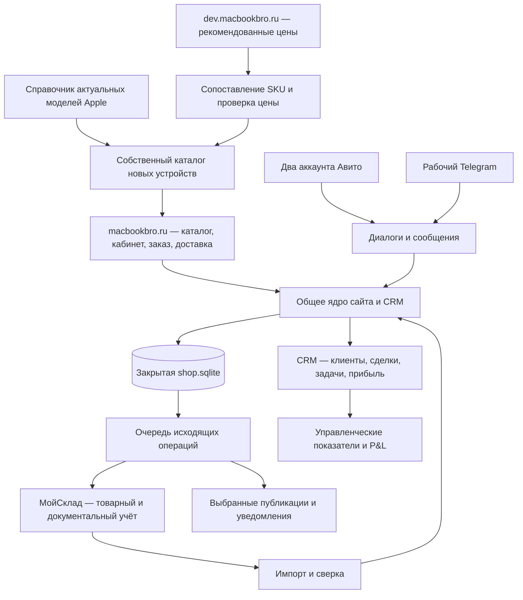

# Архитектура клиентского сайта и CRM Макбучной

Дата: 1 октября 2026 года. Результат этого этапа — проект архитектуры и порядок реализации. Целевой результат разработки — наполненный каталог на macbookbro.ru, личный кабинет, оформление заказа и доставки, админка и CRM с автоматическим получением переписки и данных МойСклад. Описанные ниже новые функции ещё не реализованы и не опубликованы этим документом.

Развиваем существующий магазин `storefront/` в том же репозитории. Витрина и CRM используют общее прикладное ядро; МойСклад сохраняет товарный и документальный учёт, dev поставляет рекомендованные розничные цены. Это позволяет проследить путь от обращения до продажи и подтверждённой прибыли без повторного ввода данных.

## Подтверждённые решения

- Основной адрес — `macbookbro.ru`; управление каталогом и CRM — закрытый `/crm`.
- Визуальное направление обновлено Максимом 01.10.2026: единый современный фирменный стиль для каталога, CRM, входа и парсера. Прежний стиль Apple 2006 заменён [редизайном](redesign-2026-10-01.md); публичный конфигуратор `/order/` сохраняет существующее оформление.
- Стартовый публичный ассортимент — актуальная линейка новых MacBook. Бывшие в употреблении и восстановленные устройства в этот каталог не попадают; исторические продажи остаются во внутреннем учёте.
- Цена — колонка «Рекоменд. цена» dev для точной конфигурации, без дополнительной наценки или повторного вычитания скидки.
- Покупатель может оформить заказ без регистрации. Личный кабинет дополняет этот путь.
- Доставка по России и Нижнему Новгороду, а также самовывоз. Стоимость и срок подтверждает менеджер: Максим выбрал этот вариант 01.10.2026.
- Адрес самовывоза — Нижний Новгород, Грузинская, 41а.
- Наличие, количество, закупочные цены и внутренние резервы не публикуются.
- CRM получает диалоги двух профилей Авито и рабочего Telegram `@macbookbro`; товары, клиентов и документы учёта — из МойСклад. Это разные подключения.
- Оплата в первой версии — после подтверждения менеджером. Эквайринг не добавляется как подразумеваемая часть оформления.

Остальные технические решения ниже — предложения для реализации. Условия гарантии, контакты продавца и договорённости с перевозчиками берутся из подтверждённых данных бизнеса.

## Источники и исходное состояние

Из соседних чатов прочитаны «Аудит общий», «Пересчитать управленческий P&L» и «Автоматизация ритейл бизнеса». Финансовая основа — [существующая модель P&L](https://docs.google.com/spreadsheets/d/1eYfx9IXDu7Kh10R20k-GRuJBJywM5v_cfvF3d2sW-a0/edit). Использованы результаты чатов; текущие ячейки таблицы заново не проверялись. Исторический период начинается 01.01.2026, полноценный новый управленческий учёт планируется с 01.10.2026.

Техническая основа — [бизнес-требования](storefront-business-requirements.md), [архитектурный аудит](architecture-audit-2026-09-29.md), [описание магазина](../storefront/README.md), [переписка CRM](crm-messenger.md) и [первый выпуск](storefront-release-2026-09-28.md).

| Область | Что подтверждено сейчас | Что требуется для целевого результата |
|---|---|---|
| Сайт | Публичная главная отвечает HTTP 200; 01.10.2026 в её HTML нет ссылок на товарные карточки | Наполнение новыми MacBook и новый дизайн |
| Админка | Черновики, публикация, фото, сопоставление с dev, контроль редакций | Структурированные варианты, импорт каталога и отчёт о покрытии ценами |
| Заказы | Корзина, фиксация цены и конфигурации, защита от дублей | Доставка, кабинет, уведомления и связь с клиентом |
| CRM | Заказы, статусы, заметки, клиенты из заказов, очередь обмена | Отдельные клиенты, сделки, ответственные, задачи, причины потерь |
| Переписка | Локальный inbox, импорт Авито, поиск, черновики, защита дублей | Постоянная синхронизация, второй профиль, Telegram, связь с клиентами |
| МойСклад | Адаптер отправки цены и создания заказа; сопоставления задаются явно | Импорт клиентов, номенклатуры, движения, документов и себестоимости |
| Доступ | `/crm` без авторизации отвечает HTTP 401 | Именные сотрудники и отдельная авторизация покупателей |
| Проверки | `npm run test:shop`: 20/20 после разрешения локальных соединений | Сквозные проверки новых функций и реальных интеграций |

Проверка HTTP не подтверждает содержимое рабочей базы или настройки внешних аккаунтов. Наличие адаптера в коде не означает рабочую интеграцию. Незакоммиченные изменения переписки и Авито уже присутствуют в общей папке; при реализации нужно сохранить их и сформировать отдельный проверяемый состав выпуска.

## Схема системы

Входящие диалоги и публикации ассортимента используют отдельные адаптеры и права. Нельзя считать подключение Авито для переписки одновременно подключением автозагрузки объявлений.

## Владение данными

| Данные | Основная система | Правило обмена |
|---|---|---|
| Карточка, фото, варианты, разрешение продажи | Сайт и CRM | Импорт создаёт кандидата; менеджер подтверждает собственный ассортимент |
| Рекомендованная цена и основания расчёта | dev | Сайт принимает точную конфигурацию и действующую версию цены |
| Опубликованная розничная цена | Сайт и CRM | В каналы и выбранный тип цены МойСклад передаётся опубликованное значение |
| Номенклатура учёта, закупки, остатки, резервы, отгрузки, оплаты, возвраты | МойСклад | CRM хранит локальное представление с внешним ID и временем последней сверки |
| Клиент, сделка, ответственный, задачи, источник обращения | CRM | Контрагент МойСклад связан отдельным идентификатором; импорт не уничтожает CRM-поля |
| Факт и текст сообщения | Исходный канал | CRM хранит копию, внешний ID, полноту истории и время синхронизации |
| Принятые условия заказа | Снимок заказа сайта | Обновление каталога не меняет принятую цену, состав или доставку |
| Управленческие расходы и достоверность себестоимости | Финансовый модуль | Сохраняются источник, метод, период и версия; оценки отделены от фактов |

Двусторонний обмен ограничен принадлежностью полей. Сотрудник видит расхождение розничной цены в МойСклад, но она не перезаписывает сайт. Смена статуса заказа в CRM сама по себе не создаёт факт оплаты или отгрузки.

## Каталог и загрузка ценников

По официальным страницам Apple, проверенным 01.10.2026, текущие ноутбуки: MacBook Neo, Air 13/15 с M5, Pro 14 с M5/M5 Pro/M5 Max и Pro 16 с M5 Pro/M5 Max. Источники: [линейка Mac](https://www.apple.com/mac/), [Air](https://www.apple.com/macbook-air/), [Pro](https://www.apple.com/macbook-pro/). Перед публикацией конкретных вариантов характеристики проверяются по соответствующим спецификациям и артикулу.

Справочник Apple задаёт допустимые модели и сочетания параметров. Он не доказывает возможность закупки и не поставляет рублёвый ценник Макбучной. Первый релиз ограничен MacBook; схема допускает другие категории Apple позднее. Google Pixel из старого сервиса заказов не переносится в этот публичный каталог.

У модели есть семейство, поколение, размер экрана и статус актуальности. Продаваемый SKU дополнительно фиксирует чип, CPU/GPU, RAM, SSD, цвет, клавиатуру, регион, комплект и состояние `new`. Серийный номер относится к внутреннему экземпляру учёта, а не к публичному SKU.

Загрузка выполняется в следующем порядке:

1. Импортировать справочник моделей и подтверждённую номенклатуру МойСклад; создать или обновить кандидатов по стабильным ключам.
2. Отфильтровать устаревшие модели, б/у, refurbished, неизвестное состояние и неподтверждённые комплектации. Исторические учётные записи сохранить.
3. Сопоставить наш SKU с точной конфигурацией dev и UUID товара/модификации МойСклад. Не использовать fuzzy matching как достаточное основание для публикации.
4. Проверить пригодность и срок действия «Рекоменд. цены». Исключить собственные сайт и объявления из источников расчёта.
5. Подтвердить возможность исполнения заказа, описание, фото и условия гарантии; опубликовать наш SKU.
6. Поставить опубликованную редакцию в очередь только выбранных каналов. Повтор импорта обновляет прежний SKU и не создаёт новую карточку или объявление.

Все семейства актуальной линейки представлены в навигации. Если для модели ещё нет подтверждённого предложения, страница семьи позволяет запросить конфигурацию; она не выдаётся за продаваемую позицию с придуманной ценой. Полнота наполнения измеряется отчётом: модель → наши SKU → сопоставленные ценники → опубликованные карточки → причины пропусков.

Сейчас рекомендации строятся `storefront/prices.mjs` через общие `web/price-table.js` и `web/retail-analytics.js`; по умолчанию срок цены — 4 часа от исходного наблюдения. Сохраняем это поведение. Целевой межсервисный контракт передаёт `configuration`, `recommendationKey`, `recommendedRub`, `observedAt`, `expiresAt`, `policy`, версии правил и снимка. Это будущий контракт, а не уже существующий отдельный API.

Нет свежего значения — карточка показывает «Цена по запросу». Заказ сохраняется как запрос, менеджер согласует стоимость. Импорт и сетевой повтор не обновляют возраст исходного наблюдения. Публичные ответы содержат только разрешённые поля: характеристики, опубликованную цену, гарантию и фотографии.

## Страницы и стиль Apple 2006 года

| Раздел | Содержание |
|---|---|
| `/` | Семейства MacBook, краткое предложение магазина, переход к выбору |
| `/catalog` и страницы семейств | Только утверждённые новые SKU, поиск и фильтры по характеристикам |
| `/p/:id` | Выбор конфигурации, цена, описание, фото по запросу, гарантия, заказ |
| `/cart`, `/checkout` | Состав, контакт, способ получения и явное подтверждение условий |
| `/account` | Собственные заказы, подтверждённые условия, доставка, документы и обращение по заказу |
| `/delivery`, `/contacts` | Подтверждённые условия доставки, самовывоз и контакты |
| `/crm` | Работа сотрудников с теми же заказами и клиентами |

Предлагаемая визуальная система: светлая страница, графитовая навигация с мягким металлическим градиентом, тонкие разделители, компактные вкладки, голубые кнопки в духе Aqua, системные Lucida Grande/Arial. Главная организована вокруг семейств техники; характеристики оформляются короткими таблицами. Используем название «Макбучная» и собственный знак.

Внешний вид сочетается с адаптацией под телефон, читаемыми формами и доступными с клавиатуры действиями. Каталог и оформление работают через серверный HTML; JavaScript добавляет удобство выбора и обновления, но не требуется для сохранения заказа.

Сохраняется прежний проверяемый бюджет: менее 14 000 байт для первоначальной публичной страницы, включая встроенные стили. Автоматической загрузки фото и тяжёлых виджетов нет; фото открываются действием покупателя. Если на следующем этапе потребуется автоматическое большое фото на первом экране, общий бюджет необходимо пересмотреть явно: один только малый HTML не доказывает соответствие старому ограничению.

## Личный кабинет, заказ и доставка

Для первой версии предлагается вход по одноразовой ссылке на подтверждённый email. Необязательный email добавляется при заказе или создании кабинета; телефон остаётся достаточным для гостевого заказа. Почтовый адаптер подключается к реальному отправителю до коммерческого запуска. Ссылка короткоживущая и одноразовая, в базе хранится её хеш; ответ формы не раскрывает существование аккаунта. SMS и вход через Telegram можно добавить через отдельные адаптеры после выбора способа авторизации.

Внутренняя карточка клиента, контрагент МойСклад и аккаунт покупателя — отдельные сущности. Совпадение введённого телефона или имени не открывает историю. Заказ привязывается к кабинету при создании из авторизованной сессии либо через подтверждение доступа к конкретному заказу. Старая гостевая квитанция остаётся доступна своей сессии. Клиент видит только публичные статусы и адресованные ему документы; служебная переписка и маржа в кабинет не попадают.

Путь заказа:

1. Сервер фиксирует выбранный SKU, редакцию и действующую цену в checkout.
2. Покупатель выбирает самовывоз, доставку по НН или отправку по России. Для доставки указывает город и контакт получателя; адрес или пункт выдачи можно уточнить при подтверждении.
3. Заказ и исходящие задачи сохраняются одной транзакцией. Повтор отправки возвращает прежний номер. Изменение цены или характеристик до отправки требует нового подтверждения.
4. CRM назначает ответственного. Менеджер проверяет обеспечение и согласует товар, стоимость доставки, способ оплаты и срок.
5. Покупатель подтверждает итог через отдельное предложение в кабинете/ссылке заказа либо менеджер фиксирует подтверждение из связанного диалога с временем и основанием.
6. В МойСклад создаётся или находится тот же заказ по внешнему коду. После исполнения возвращаются документы и факты оплаты, отгрузки и возврата.
7. Менеджер добавляет перевозчика и трек-номер; покупатель видит их в кабинете. Автоматическое получение статусов перевозчика — отдельное расширение.

Суммы товара и доставки хранятся раздельно в копейках. До подтверждения доставки показываются «Стоимость доставки уточняется» и сумма товаров, а не ложный окончательный итог. `shippingFee=null` означает неизвестную стоимость; `shippingFee=0` — подтверждённую бесплатную доставку. Принятые условия версионируются и не меняются вслед за новым тарифом.

Статус заказа, состояние оплаты и состояние доставки независимы. Для доставки предусмотрены ожидает согласования → согласована → передана перевозчику → получена, отдельно отмена/возврат. Отгрузка учётного документа и получение покупателем — разные события.

## CRM и единая карточка клиента

Главный рабочий экран — входящие обращения и действия на сегодня. Менеджер видит канал, аккаунт, последнее сообщение, время ожидания, клиента, связанную сделку, ответственного и следующее действие. Рядом — заказ и нужная конфигурация без копирования между страницами.

Предлагаемые разделы: обзор, переписка, клиенты, сделки, заказы, задачи, каталог, цены, доставки, интеграции; финансовые показатели доступны владельцу. Разделы используют одно ядро, а не отдельные несовместимые CRM-базы.

Карточка клиента объединяет подтверждённые контакты, внешние идентификаторы, диалоги, сделки, покупки и возвраты. Диалог не равен сделке: несколько диалогов могут относиться к одной продаже, а в одном диалоге бывают повторные покупки. Воронка сделки отделена от статуса заказа: новая → контакт → предложение → ожидание решения → выиграна/потеряна. У потери обязательна причина; финансовый результат появляется по учётным документам.

Автоматическое объединение выполняется только по подтверждённым внешним связям или проверенному контакту с однозначным совпадением. Имя и Telegram username недостаточны. Неоднозначные записи предлагаются менеджеру для сверки; объединение и разделение сохраняют историю. Загрузка клиента из МойСклад не создаёт ему покупательский доступ.

У каждого обращения есть ответственный, дата следующего действия и история смены статусов. SLA ответа настраивается по рабочим часам, не выдаёт ночные часы за рабочую просрочку. Метрики первой версии: необработанные обращения, время первого ответа, конверсия по источникам, потери по причинам, сумма и прибыль подтверждённых продаж.

## Постоянное получение переписки

Адаптер каждого аккаунта выполняет первоначальный импорт и затем синхронизирует изменения. Идентификатор сообщения уникален в пределах канала, аккаунта и диалога; ID разных профилей не объединяются. Хранятся курсор, последняя успешная синхронизация, охват истории и состояние подключения. Повторное получение обновляет запись, сохраняя заметки и связи CRM.

Авито: используются отдельные OAuth-подключения двух профилей. По локальному исследованию от 30.09 первый профиль позволил получить 1100 диалогов и 1095 последних сообщений, но запрос истории вернул HTTP 402. Это частичный импорт, а не весь архив и не подтверждение сегодняшнего тарифа. Требуются доступ к API мессенджера и проверка пагинации/покрытия. Второму профилю нужна отдельная пара ключей. Актуальные права проверяются в кабинете и по [документации Авито](https://developers.avito.ru/api-catalog).

Telegram: для облачной истории рабочего аккаунта нужен авторизованный пользовательский API-клиент. `messages.getDialogs` и `messages.getHistory` предназначены для пользователей; один Bot API не даёт этот архив. Приложение получает API ID/hash, владелец подтверждает вход; сессия хранится отдельно от репозитория. Источники: [список диалогов](https://core.telegram.org/method/messages.getDialogs), [история](https://core.telegram.org/method/messages.getHistory), [получение API ID](https://core.telegram.org/api/obtaining_api_id). Импорт охватывает доступную облачную историю, включая архив; секретные чаты в неё не входят.

Предлагаемый режим: события обновления, когда их поддерживает канал, плюс периодическая сверка; запасной polling с учётом лимитов аккаунта. Целевое появление нового сообщения в CRM — до 60 секунд при исправном подключении, проверяется после подключения реальных API. История загружается отдельно и не задерживает новые обращения. Редактирование и удаление сообщений учитываются, если канал предоставляет такие события.

Открытие CRM не помечает диалог прочитанным на площадке. Ответ отправляется явным действием сотрудника из исходного аккаунта. Черновик не является отправленным сообщением. Потеря подтверждения отправки приводит к состоянию «Нужно сверить результат», а не к автоматическому повтору. Автоматические ответы клиентам не включаются этим архитектурным этапом.

## Обмен с МойСклад

Предлагается отдельный адаптер JSON API 1.2. Начальная загрузка создаёт локальное представление номенклатуры, контрагентов, документов с 01.01.2026, остатков, резервов и доступных данных себестоимости. Сохраняются внешние UUID, версия/время изменения, исходная запись и время чтения. Источник возможностей — [официальная документация JSON API](https://dev.moysklad.ru/doc/api/remap/1.2/); нужные права и покрытие конкретного аккаунта проверяются перед реализацией.

Для каждой сущности храним независимый курсор. Инкрементальное чтение использует перекрытие периода и стабильный порядок; курсор продвигается только после сохранения полной страницы. Нельзя потерять записи с одинаковым временем изменения. Удаления, архивирование и изменение проведения документов обрабатываются отдельно. Вебхуки, где доступны, ставят задачу чтения, а периодическая сверка исправляет пропущенные события.

Входящий вебхук не является доверенным учётным документом: обработчик проверяет допустимые ссылки и получает объект через авторизованный API. Повторы чтения используют задержку и лимиты провайдера; HTTP 429 замедляет запросы, потеря прав останавливает соответствующий аккаунт и создаёт задачу владельцу. Предлагаемые интервалы: изменение документов — до 5 минут, контрольная сверка — ежедневно; итоговые значения выбираются по лимитам и объёму реального аккаунта.

Сейчас создание заказа использует общего настроенного контрагента. Целевая версия сначала связывает или создаёт нужного контрагента, затем заказ покупателя. `externalCode` служит ключом сверки, но не считается гарантированным уникальным ограничением внешней системы: локальная очередь сериализует создание, а несколько найденных документов требуют разбора.

До открытия резерва учитываются актуальность данных и согласованный заказ. Правило резервирования подтверждается в бизнес-процессе: простая заявка на неизвестную цену не блокирует товар. Отмена освобождает именно связанный резерв; возврат оформляется отдельным документом. Повтор задачи не создаёт вторую закупку, оплату или отгрузку.

Сетевая ошибка не отменяет сохранённый заказ сайта. CRM показывает задолженность синхронизации, последний успешный обмен и документ МойСклад. Ожидаемые изменения проходят через очередь; неожиданные изменения финансовых документов остаются видимыми расхождениями.

## Выводы P&L для модели данных

Аудит обнаружил неполную себестоимость, расхождение между документально покрытой прибылью и GP МойСклад, необходимость отдельного учёта логистики и проверки движения товара. Расчёт закупок с января, ещё не проданных, является отдельным аналитическим срезом и не заменяет фактический текущий склад. Эти ограничения определяют следующие правила.

| Вывод | Архитектурное решение |
|---|---|
| Нулевой закуп может означать отсутствие данных | Неизвестная стоимость — `null` и `UNKNOWN`; реальный ноль требует подтверждённого основания |
| Оценки нельзя смешивать с документами | Для стоимости сохраняются `FACT`, `MANUAL`, `ESTIMATE`, `UNKNOWN`, источник и метод |
| Созданный заказ ещё не является выручкой | Признание продажи привязано к выбранному виду проведённого учётного документа, возвраты уменьшают результат |
| Оплата и прибыль расходятся | Денежные поступления и управленческая выручка учитываются раздельно |
| Логистика может уже входить в COGS | Каждый расход связан с поставкой/заказом и имеет признак включения в себестоимость; повторного вычитания нет |
| Остаток по документам требует сверки | Движение учитывает начальные остатки, поступления, продажи, списания и возвраты; отрицательные позиции — задача разбора |
| Закупки 2026 — отдельная когорта | Хранить дату и партию закупки; показать этот срез отдельно от полного склада |
| Подписка и офис — расходы периода | OPEX хранятся по периоду; внутреннее распределение не начисляет вторую наценку поверх цены сайта |

CRM показывает ожидаемую прибыль при согласовании и отдельно фактическую после продажи. При `UNKNOWN` прибыль не считается нулевой себестоимостью. Оценочная прибыль явно помечается; сводка показывает долю выручки с подтверждённым закупом и неподтверждённую часть. GP из отчёта МойСклад сохраняется как отдельный показатель для сверки, а не молча заменяет наш расчёт.

Доход от доставки покупателю и фактическая оплата перевозчику — разные записи. Расходы и комиссии учитываются один раз по подтверждённой методике; сценарные расходы не выдаются за факт. Пересчёт финансовых правил создаёт новую версию и не переписывает исходный документ продажи.

## Хранилище и модули

Сохраняем Node.js 24, серверный HTML, SQLite WAL и Caddy на существующем сервере. В первой версии один сервис владеет записью `shop.sqlite`; сетевые ожидания не держат транзакцию. Тяжёлый импорт и Telegram-клиент работают отдельно и передают события через закрытый локальный интерфейс. Переход к отдельному процессу очереди возможен после добавления lease/claim: текущий startup-reset работающих задач нельзя использовать одновременно в двух процессах.

Предлагаемые границы модулей в `storefront/`: каталог и сопоставления; цены; клиенты и аккаунты; сделки и задачи; заказы; доставка; переписка; МойСклад; финансы; очередь интеграций; HTML-представления. Общие правила цены остаются общими с dev. Выделение модулей выполняется постепенно, сохраняя проверенное поведение `core.mjs`, `server.mjs` и inbox.

| Группа данных | Сущности для новых миграций |
|---|---|
| Каталог | Семейства, модели, SKU, сопоставления dev/МойСклад, редакции публикаций, фото |
| Клиенты и доступ | Клиенты, подтверждённые контакты, внешние идентификаторы, аккаунты покупателей, именные сотрудники, сессии |
| Работа продаж | Сделки, связи диалогов со сделками, задачи, причины потерь, история ответственных |
| Заказы | Существующий неизменяемый снимок, связь с клиентом, строки заказа, предложения новых условий |
| Доставка и оплата | Способ получения, адрес/ПВЗ, согласованная цена, трек, события; отдельные факты оплаты |
| Учёт | Реплики документов и строк МойСклад, партии, серийные экземпляры, остатки и резервы |
| Финансы | Факты/оценки себестоимости, распределение логистики, расходы периода, версии расчёта |
| Интеграции | Входящие события, курсоры, исходящие операции, аренды выполнения, внешние публикации, аудит |

Существующие таблицы и JSON-снимки заказов сохраняются. Новые связи добавляются миграциями с номером, checksum и журналом применения, внешними ключами и индексами. Суммы нормализуются в целые копейки; миграция старых рублёвых данных сверяет итог каждого заказа. Для редактируемых сущностей нужны контроль редакции и журнал автора.

У входящего события уникальный внешний ключ; у исходящей операции — ключ намерения и редакция. Смена состояния и запись исходящей задачи атомарны. Операция проверяет актуальную редакцию перед выполнением; снятый товар не возвращается из старой задачи. После неопределённого внешнего создания выполняется поиск результата, а не слепой повтор.

## Доступ и эксплуатация

Публичная витрина, кабинет покупателя и CRM имеют отдельные проверки полномочий. Сотрудники переходят от общего менеджерского пароля к именным учётным записям. Владелец управляет интеграциями и финансами; менеджер — порученными обращениями и заказами; разрешение редактировать каталог задаётся отдельно. Аудит содержит сотрудника, действие, объект и время.

Сохраняются Origin/CSRF, защищённые cookie, ограничения запросов и явный публичный список полей. Файлы и документы клиента выдаются с проверкой доступа. Секреты МойСклад, Авито и Telegram хранятся на сервере вне Git; клиентский сайт и сборщик цен их не получают. Логи не содержат токены, коды входа и сырые персональные сообщения.

Сохраняется разделение контуров: dev — рабочий источник цен; macbookbro.ru — магазин и CRM; order.macbookbro.ru — старые заявки до отдельного переноса. Существующие заказы и ссылки не удаляются. Новый магазин не требует перенаправления order для первого выпуска; миграция старых заявок выполняется по стабильному ключу после сверки.

Предлагаемые операционные цели: ежедневная согласованная резервная копия БД и media вне сервера, RPO до 24 часов и RTO до 2 часов, подтверждённые учебным восстановлением. Очереди уведомлений, возраст цен и время последнего импорта контролируются постоянно. Это цели, а не уже настроенные гарантии.

## Порядок реализации и приёмка

| Этап | Конкретный результат | Проверка завершения |
|---|---|---|
| 1. Данные | Миграции, модели и SKU, импорт МойСклад, сопоставление ценников | Повтор импорта не создаёт дубль; неизвестное состояние и несовместимая конфигурация блокируются; отчёт показывает покрытие актуальных семейств |
| 2. Каталог и админка | Apple 2006, реальные новые предложения, управление вариантами и публикациями | Опубликованный ценник совпадает с dev; пустые/просроченные значения показываются честно; скрытых остатков нет; соблюдён бюджет страницы |
| 3. Покупка | Кабинет, гостевой заказ, доставка и согласование итоговой суммы | Проверены чужой заказ, повтор формы, смена цены, неизвестная доставка, подтверждение новых условий и получение квитанции |
| 4. CRM и обмен | Именные сотрудники, клиент, сделка, задачи, постоянные Авито/Telegram и МойСклад | Новый диалог связан с клиентом; совпадающие ID двух профилей не смешиваются; заказ передан один раз; возврат и расход отражены; неполная история отмечена |
| 5. Выпуск | Проверенный релиз на macbookbro.ru с наполненным каталогом, кабинетом, админкой и CRM | Сквозной согласованный тест обращения → заказа → доставки → учётного документа → прибыли; резервная копия восстановлена; после публикации проверены живые страницы и защита |

Этапы — контрольные точки разработки, не обещание календарных сроков до подключения аккаунтов. Базовый магазин не считается завершением всего запроса без кабинета, доставки и рабочих синхронизаций. Публикация карточек в дополнительные внешние каналы использует прежний выбор каналов и отдельно проверенные аккаунты.

Перед функциональным выпуском проходят проверки магазина, старых заказов, общего проекта и типов; миграции проверяются на копии рабочей базы. Подготовленная версия устанавливается с сохранением предыдущей версии кода и резервной копией данных. Откат приложения не стирает принятые после публикации заказы; совместимость схемы проверяется до обновления.

Для полной рабочей CRM остаются конкретные внешние зависимости: права МойСклад и сопоставления учёта, доступ первого Авито к истории, ключи второго профиля, авторизация рабочего Telegram, отправитель почты кабинета. Для каталога нужны подтверждённые товарные предложения, характеристики, фото и условия гарантии. Их недоступность не заменяется демонстрационными данными и не мешает подготовке схемы, интерфейсов и проверок.

Архитектурный этап завершён этим документом. Коммит, пуш и развёртывание будущего функционального выпуска выполняются отдельным полным циклом по правилу проекта «залей изменения», с проверкой состава релиза и без чужой незавершённой работы.
